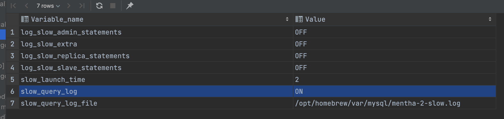

# ..

```bash
$ mysqld --verbose --help | grep my.cnf
/etc/my.cnf /etc/mysql/my.cnf /opt/homebrew/etc/my.cnf ~/.my.cnf 
                      my.cnf, $MYSQL_TCP_PORT, /etc/services, built-in default

$ vi /opt/homebrew/etc/my.cnf
# Default Homebrew MySQL server config
[mysqld]
datadir=/opt/homebrew/var/mysql
slow_query_log=1
long_query_time=1

:wq

$ brew services restart mysql
```

```sql
SHOW GLOBAL VARIABLES LIKE '%log_file%';
SHOW GLOBAL VARIABLES LIKE '%slow%';
SHOW GLOBAL VARIABLES LIKE '%long%';
```




```sql
-- create big_table for slow query testing
-- how to make gendor_dates table (Link)
create table big_table
select * from gendor_dates;

-- repeat N
insert into big_table
select * from gendor_dates;

select count(*) from big_table;
```

slow query example
```sql
# User@Host: root[root] @ localhost [127.0.0.1]  Id:     9
# Query_time: 4.580388  Lock_time: 0.000005 Rows_sent: 0  Rows_examined: 2000000
SET timestamp=1684572033;
/* ApplicationName=DataGrip 2022.1.2 */ insert into big_table
select * from gendor_dates;
# Time: 2023-05-20T08:40:42.325809Z
# User@Host: root[root] @ localhost [127.0.0.1]  Id:     9
# Query_time: 4.674516  Lock_time: 0.000001 Rows_sent: 0  Rows_examined: 2000000
SET timestamp=1684572037;
/* ApplicationName=DataGrip 2022.1.2 */ insert into big_table
select * from gendor_dates;
```

query test
```sql
real_mysql> select count(*) as cnt from big_table
            where date = '2023-04-01'
[2023-05-20 17:46:18] 1 row retrieved starting from 1 in 4 s 183 ms (execution: 4 s 166 ms, fetching: 17 ms)
real_mysql> create table indexed_big_table
            select * from big_table
```


